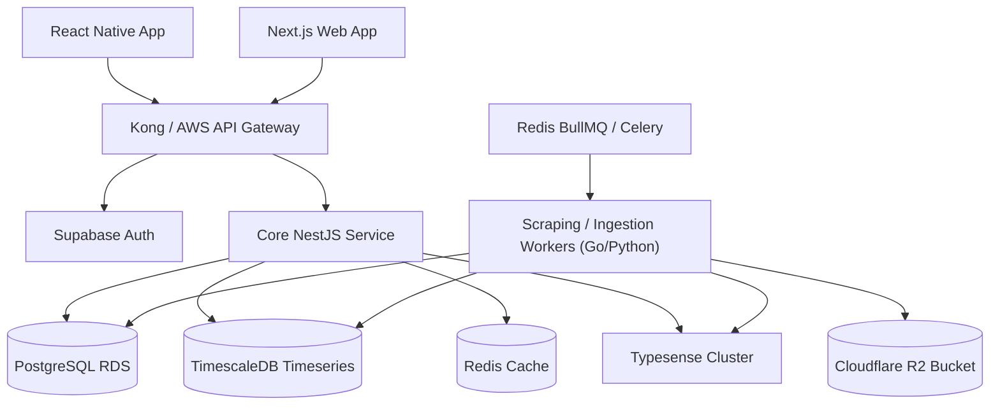
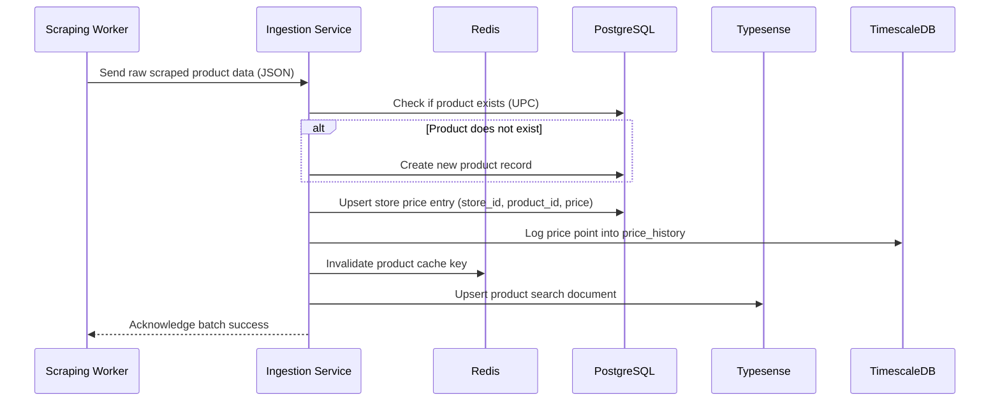
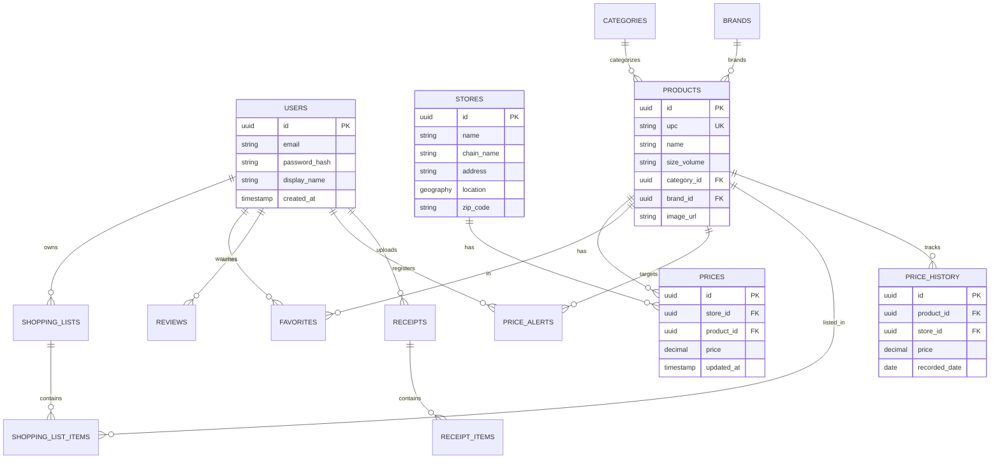

# Project Blueprint: Smart Cart Grocery Price Comparison Platform

This document serves as the comprehensive technical blueprint and development plan for building "Smart Cart," a scalable, production-ready, and modern mobile/web price comparison application.

---

## 1. Executive Summary

### 1.1 Purpose
The Smart Cart platform is designed to aggregate, normalize, and compare supermarket grocery and household product prices across multiple physical and online retailers in real-time. It empowers consumers to make data-driven purchasing decisions, optimizing their grocery spend and shopping routes.

### 1.2 Target Users
*   **Budget-Conscious Shoppers & Families**: Individuals trying to stretch their weekly household budgets amidst inflationary pressures.
*   **Gig-Economy Workers (e.g., Instacart/Shipt Shoppers)**: Professional shoppers looking to maximize their margins or locate products quickly.
*   **Smart-Home & Tech-Savvy Consumers**: Users who value automation, barcode scanning, and smart notifications for recurring purchases.
*   **Small Businesses / Caterers**: High-volume buyers searching for wholesale pricing and local deals.

### 1.3 Value Proposition
Smart Cart solves the grocery price opacity problem. Instead of checking multiple store apps or scanning paper flyers, users get an instantaneous, consolidated comparison of their exact shopping cart's cost across local supermarkets. By offering a "Split Cart" recommendation, Smart Cart tells users exactly which stores to visit to achieve the maximum savings, factoring in travel distance and transit cost.

### 1.4 Key Problems Solved
*   **Price Opacity**: Retailers often hide prices behind regional variations or loyalty programs.
*   **Time Consumption**: Manually comparing a list of 20 items across three stores takes hours.
*   **Inefficient Basket Optimization**: Individual items might be cheaper at Store A, but the overall basket is cheaper at Store B.
*   **Data Fragmentation**: Product barcodes (UPCs) are consistent, but retailer descriptions and listings are fragmented and non-standardized.

---

## 2. Market Analysis

### 2.1 Existing Competitors
*   **Flipp**: Primarily digitizes weekly print circulars and coupons. Excellent for discovering promotions but lacks real-time, item-by-item price search and cart optimization.
*   **Basket (basket.com)**: A crowd-sourced grocery comparison app. Strong concept but suffers from inconsistent data quality and slow updates in non-metro areas.
*   **Retailer Apps (e.g., Walmart, Kroger, Target)**: Provide pricing only for their own inventory, keeping shoppers locked within their ecosystem.

### 2.2 Strengths & Weaknesses of Competitors

| Competitor | Strengths | Weaknesses |
| :--- | :--- | :--- |
| **Flipp** | - High user adoption<br>- Direct retailer relationships<br>- Great promotional visual layouts | - No barcode scan price comparison<br>- No cross-retailer cart calculation<br>- Limited raw price database search |
| **Basket** | - Focuses on direct product comparison<br>- Good barcode scanning search | - Outdated UI/UX<br>- Inconsistent data accuracy<br>- High reliance on crowd inputs which fade over time |
| **Retailer Apps** | - Real-time inventory<br>- Highly accurate localized pricing | - Single-store focus<br>- Zero competitor price transparency |

### 2.3 Opportunities for Differentiation
*   **AI-Powered Product Matching**: Grouping disparate SKU strings (e.g., "Kroger 2% Milk 1Gal" and "Great Value 2% Milk 128oz") to provide a true price-per-ounce comparison.
*   **Automatic Split-Basket Optimization**: A proprietary algorithm that calculates the optimal division of a shopping list across stores (e.g., buy dairy at Store A, meat at Store B) including transit adjustments.
*   **Receipt OCR Upload**: Allow users to instantly upload their physical receipts to build shopping lists, track their price history, and update the crowdsourced price database.

### 2.4 Potential Business Models
1.  **Freemium Subscription (Smart Cart Plus)**: $2.99/month for ad-free experience, automatic price-drop push notifications, shared family shopping lists, and advanced basket splits.
2.  **Affiliate & Delivery Integrations**: Earn referral fees by allowing users to checkout directly through Instacart, Shipt, or Walmart Delivery.
3.  **B2B Market Intelligence Data**: Anonymized, aggregated shopper search and price sensitivity data sold to FMCG (Fast-Moving Consumer Goods) brands for market research.

---

## 3. Functional Requirements

### 3.1 Feature Matrix by Version

| Feature | Description | MVP | V2 | Future |
| :--- | :--- | :---: | :---: | :---: |
| **Product Search** | Text-based search of centralized product catalog | X | | |
| **Barcode Scanning** | Camera-based UPC scanning to look up item price | X | | |
| **Price Comparison** | Side-by-side price listing for a selected product | X | | |
| **Store Comparison** | Total cost of a shopping list compared across stores | X | | |
| **Product Images** | Standardized, high-quality images for products | X | | |
| **Shopping List** | Basic CRUD list of products to purchase | X | | |
| **Favorites** | Saved items watchlist | X | | |
| **User Accounts** | Email, Google, Apple signup/login | X | | |
| **Store Locations** | Basic directory of nearby stores (by zip code) | X | | |
| **Price Alerts** | Push notifications and emails when watched items drop in price | | X | |
| **Promotions & Coupons**| Retailer circulars, BOGOs, and loyalty card adjustments | | X | |
| **Map Integration** | Interactive map with routing to cheapest stores | | X | |
| **Receipt Scanning** | OCR parsing of receipts to update prices / create lists | | X | |
| **Reviews & Ratings** | User reviews of products and store experiences | | X | |
| **Basket Optimizer** | Algorithmic split-basket routing generator | | | X |
| **Gamified Crowd Updates**| Rewards/Points for users submitting verified store prices | | | X |
| **AI Recommendations** | "Frequently bought together" and budget alternatives | | | X |
| **Admin Dashboard** | Database curation, manual matching, scraping monitoring | X | | |

---

## 4. Non-Functional Requirements

*   **Performance**:
    *   Search queries must return results in under **500ms** (p95) under average load.
    *   Mobile application startup to active UI state must be under **2.0 seconds**.
*   **Scalability**:
    *   Database architecture must support a product catalog of up to **10 million items** and **50,000 physical store locations**.
    *   API layer must scale horizontally to handle **500,000 daily active users (DAUs)**.
*   **Security & Privacy**:
    *   All customer traffic must be encrypted via HTTPS/TLS 1.3.
    *   Comply with GDPR and CCPA (right to be forgotten, data export).
    *   No plaintext passwords; secure salting and hashing (Argon2id/bcrypt) or delegated auth providers (Supabase Auth/Clerk).
*   **Accessibility**:
    *   Web application must conform to **WCAG 2.1 AA** standards.
    *   Mobile app must support native dynamic text scaling and screen readers (TalkBack/VoiceOver).
*   **Reliability**:
    *   System availability SLA of **99.9%** (excluding planned maintenance).
    *   Automated daily database backups with point-in-time recovery (PITR) up to 30 days.
*   **Offline Support**:
    *   The shopping list and favorites must be readable and editable offline. Changes must queue locally and synchronize once network connectivity is restored.
*   **Localization**:
    *   Support for multiple languages (starting with English and Spanish) using native internationalization framework (i18next).
    *   Support local currencies (USD, CAD, EUR) and unit configurations (ounces/grams, gallons/liters).
*   **Monitoring & Logging**:
    *   Centralized logging with structured JSON output.
    *   Real-time system metric collection (CPU, Memory, DB connection pool sizing).

---

## 5. Recommended Technology Stack

We recommend a **TypeScript Monorepo** architecture to allow shared types between the frontend web, mobile app, and backend APIs.

```
┌────────────────────────────────────────────────────────┐
│                   Turborepo (Monorepo)                 │
├───────────────────┬───────────────────┬────────────────┤
│      Web Client   │    Mobile App     │  Backend API   │
│    (Next.js v15)  │  (React Native)   │ (NestJS/Node)  │
└───────────────────┴───────────────────┴────────────────┘
```

### 5.1 Tech Stack Specifications

*   **Frontend (Web)**: **Next.js (App Router)**. Chosen for its robust Server-Side Rendering (SSR) capabilities which are essential for indexing product pages for SEO search traffic.
*   **Mobile Application**: **React Native (Expo)**. Allows for cross-platform iOS and Android deployment from a single codebase while providing native camera performance for rapid barcode scanning.
*   **Backend API**: **NestJS (Node.js/TypeScript)**. A progressive TypeScript framework that enforces a modular architecture, clean dependencies, and integrates seamlessly with Prisma ORM.
*   **Database Engine**:
    *   **PostgreSQL**: Primary transactional database (stores, users, categories, shopping lists).
    *   **TimescaleDB** (PostgreSQL extension): Specifically for storing millions of rows of historical price data points over time, permitting fast time-series analytical queries.
*   **Authentication**: **Supabase Auth / GoTrue**. Secure, fully-managed authentication system supporting email/password, magic links, OAuth providers (Google/Apple), and Row-Level Security (RLS) integration.
*   **File Storage**: **Cloudflare R2** (S3-compatible API). Replaces AWS S3 due to zero egress fees, significantly lowering costs for hosting millions of compressed product and receipt images.
*   **Search Engine**: **Typesense** or **Meilisearch**. An open-source, ultra-fast search engine tailored for instant search-as-you-type and typo tolerance. Easier to maintain than Elasticsearch.
*   **Caching**: **Redis**. Used for session caching, caching API responses, rate-limiting, and managing the queue of background scraping tasks.
*   **API Architecture**: **GraphQL (Apollo Server/Client)**. Ideal for the mobile client. It prevents over-fetching of data (e.g., retrieving store lists without downloading all pricing tables) and enables declarative client requests. REST endpoints will be retained for webhooks and ingestion workers.
*   **Hosting & Cloud Infrastructure**:
    *   **Frontend Web**: Vercel.
    *   **Backend & DB**: AWS (ECS Fargate for containerized APIs, RDS Aurora Serverless v2 for PostgreSQL).
*   **CI/CD**: **GitHub Actions**. Automated linting, testing, Docker image building, and deployment orchestration.
*   **Monitoring & Error Reporting**: **Sentry** (for tracking runtime errors on client/server) and **Datadog** or **Grafana Cloud** (for metrics and traces).

---

## 6. System Architecture

### 6.1 High-Level Architecture Diagram
The application follows a decoupled microservices-adjacent architecture hosted within a Virtual Private Cloud (VPC). The Ingestion Engine operates independently to ensure scraping/import spikes do not impact the transactional database accessed by clients.



### 6.2 Data Ingestion & Sync Flow
To ensure data is fresh without degrading app performance, price ingestion follows an asynchronous process.



### 6.3 Background Jobs
Background processes are orchestrated via **BullMQ** (Redis-backed queue):
1.  **Weekly Store Scraping**: Rotated schedule to scrape regional chain prices.
2.  **Alert Processing**: Scrapes or user updates trigger a check against `price_alerts` table; matching items push messages to the Notification Queue.
3.  **Data Pruning**: Weekly aggregation of granular, intraday price entries into daily averages in `price_history`.

---

## 7. Database Design

### 7.1 Entity Relationship Diagram (ERD)



### 7.2 Database Schema (PostgreSQL DDL Example)

```sql
-- Enable PostGIS for geospatial location queries
CREATE EXTENSION IF NOT EXISTS postgis;

-- Users Table
CREATE TABLE users (
    id UUID PRIMARY KEY DEFAULT gen_random_uuid(),
    email VARCHAR(255) UNIQUE NOT NULL,
    display_name VARCHAR(100),
    created_at TIMESTAMP WITH TIME ZONE DEFAULT CURRENT_TIMESTAMP NOT NULL
);

-- Stores Table
CREATE TABLE stores (
    id UUID PRIMARY KEY DEFAULT gen_random_uuid(),
    name VARCHAR(100) NOT NULL,
    chain_name VARCHAR(100) NOT NULL,
    address TEXT NOT NULL,
    zip_code VARCHAR(20) NOT NULL,
    location GEOGRAPHY(POINT, 4326) NOT NULL,
    created_at TIMESTAMP WITH TIME ZONE DEFAULT CURRENT_TIMESTAMP NOT NULL
);

-- Categories Table
CREATE TABLE categories (
    id UUID PRIMARY KEY DEFAULT gen_random_uuid(),
    name VARCHAR(100) NOT NULL UNIQUE,
    parent_id UUID REFERENCES categories(id)
);

-- Brands Table
CREATE TABLE brands (
    id UUID PRIMARY KEY DEFAULT gen_random_uuid(),
    name VARCHAR(100) NOT NULL UNIQUE
);

-- Products Table
CREATE TABLE products (
    id UUID PRIMARY KEY DEFAULT gen_random_uuid(),
    upc VARCHAR(14) UNIQUE NOT NULL,
    name VARCHAR(255) NOT NULL,
    size_volume VARCHAR(50), -- e.g., "128 oz", "1 kg"
    category_id UUID REFERENCES categories(id),
    brand_id UUID REFERENCES brands(id),
    image_url TEXT,
    created_at TIMESTAMP WITH TIME ZONE DEFAULT CURRENT_TIMESTAMP NOT NULL
);

-- Current Prices Table
CREATE TABLE prices (
    id UUID PRIMARY KEY DEFAULT gen_random_uuid(),
    store_id UUID REFERENCES stores(id) ON DELETE CASCADE NOT NULL,
    product_id UUID REFERENCES products(id) ON DELETE CASCADE NOT NULL,
    price DECIMAL(10, 2) NOT NULL,
    updated_at TIMESTAMP WITH TIME ZONE DEFAULT CURRENT_TIMESTAMP NOT NULL,
    UNIQUE(store_id, product_id)
);

-- Price History Table (Configured for TimescaleDB partitioning in production)
CREATE TABLE price_history (
    time TIMESTAMP WITH TIME ZONE NOT NULL,
    store_id UUID NOT NULL,
    product_id UUID NOT NULL,
    price DECIMAL(10, 2) NOT NULL
);

-- Shopping Lists Table
CREATE TABLE shopping_lists (
    id UUID PRIMARY KEY DEFAULT gen_random_uuid(),
    user_id UUID REFERENCES users(id) ON DELETE CASCADE NOT NULL,
    name VARCHAR(100) NOT NULL,
    created_at TIMESTAMP WITH TIME ZONE DEFAULT CURRENT_TIMESTAMP NOT NULL
);

-- Shopping List Items Table
CREATE TABLE shopping_list_items (
    id UUID PRIMARY KEY DEFAULT gen_random_uuid(),
    shopping_list_id UUID REFERENCES shopping_lists(id) ON DELETE CASCADE NOT NULL,
    product_id UUID REFERENCES products(id) ON DELETE CASCADE NOT NULL,
    quantity INTEGER DEFAULT 1 NOT NULL,
    added_at TIMESTAMP WITH TIME ZONE DEFAULT CURRENT_TIMESTAMP NOT NULL,
    UNIQUE(shopping_list_id, product_id)
);
```

### 7.3 Indexing Strategy
To maintain search latency thresholds (<500ms):
*   **Geospatial Index**: `CREATE INDEX idx_stores_location ON stores USING GIST (location);` - crucial for finding stores near a user's GPS point.
*   **Unique Index on Barcodes**: `CREATE UNIQUE INDEX idx_products_upc ON products(upc);` - for instant scanning lookups.
*   **Covering Index for Pricing Queries**: `CREATE INDEX idx_prices_lookup ON prices (product_id, store_id) INCLUDE (price);` - allows index-only scans when rendering price comparisons.
*   **Foreign Keys**: Explicit indexes on all FK columns (`user_id`, `category_id`, `brand_id`) to optimize join queries.

### 7.4 Data Retention Strategy
*   **Raw Prices**: The `prices` table keeps only the latest price.
*   **Historical Data**: `price_history` database logs all changes. To prevent infinite database growth:
    *   **0-90 Days**: Retain all recorded raw data points.
    *   **91-365 Days**: Aggregate entries into a single average price point per store/product per week. Roll-up background jobs run automatically.
    *   **1+ Years**: Purge records unless they are tracked as popular products, in which case retain monthly aggregates.

---

## 8. API Design

### 8.1 Authentication Endpoint
`POST /api/v1/auth/login`

*   **Request Payload**:
```json
{
  "email": "user@example.com",
  "password": "SuperSecurePassword123"
}
```

*   **Response Payload (200 OK)**:
```json
{
  "status": "success",
  "data": {
    "token": "eyJhbGciOiJIUzI1NiIsInR5cCI6IkpXVCJ9...",
    "user": {
      "id": "8a32a688-6625-4c07-b31a-cde9655f419b",
      "email": "user@example.com",
      "displayName": "Jane Doe"
    }
  }
}
```

### 8.2 Product Search & Details Endpoints
`GET /api/v1/products/search?q=milk&lat=37.7749&lng=-122.4194&radius=10`

*   **Response Payload (200 OK)**:
```json
{
  "status": "success",
  "results_count": 1,
  "data": [
    {
      "id": "3a0be12c-9a4f-4d33-911e-0897ff78e1b6",
      "upc": "011110416001",
      "name": "Kroger 2% Reduced Fat Milk",
      "brand": "Kroger",
      "size": "1 Gallon",
      "lowest_price": 2.99,
      "highest_price": 3.89,
      "stores_nearby_count": 3
    }
  ]
}
```

`GET /api/v1/products/:id/prices?lat=37.7749&lng=-122.4194`

*   **Response Payload (200 OK)**:
```json
{
  "status": "success",
  "product_id": "3a0be12c-9a4f-4d33-911e-0897ff78e1b6",
  "prices": [
    {
      "store_id": "c1a96756-11f4-411a-8bb7-08bb39a16f9f",
      "store_name": "Kroger - 4th Street",
      "distance_miles": 1.2,
      "price": 2.99,
      "updated_at": "2026-07-13T12:00:00Z"
    },
    {
      "store_id": "d8204620-3b47-4a0b-93ff-183e20decfd2",
      "store_name": "Whole Foods Market",
      "distance_miles": 2.5,
      "price": 3.89,
      "updated_at": "2026-07-13T10:15:00Z"
    }
  ]
}
```

### 8.3 Shopping List Endpoint
`POST /api/v1/lists/:id/items`

*   **Request Payload**:
```json
{
  "product_id": "3a0be12c-9a4f-4d33-911e-0897ff78e1b6",
  "quantity": 2
}
```

*   **Response Payload (201 Created)**:
```json
{
  "status": "success",
  "data": {
    "list_id": "99ee4a4c-1e24-4f81-a67b-232cc22904c0",
    "item": {
      "product_id": "3a0be12c-9a4f-4d33-911e-0897ff78e1b6",
      "quantity": 2,
      "added_at": "2026-07-13T17:05:00Z"
    }
  }
}
```

---

## 9. UI/UX Plan

### 9.1 Major Screen Workflows

```
┌─────────────┐     ┌─────────────┐     ┌──────────────┐     ┌─────────────────┐
│ Splash Screen│ ──> │Login/Signup │ ──> │ Home Screen  │ ──> │ Search/Scan Results│
└─────────────┘     └─────────────┘     └──────────────┘     └─────────────────┘
                                               │                      │
                                               ▼                      ▼
                                        ┌──────────────┐     ┌─────────────────┐
                                        │Shopping List │     │ Product Details │
                                        └──────────────┘     └─────────────────┘
```

### 9.2 Key Screen Specifications

1.  **Home Screen**
    *   **Purpose**: User landing dashboard, featuring saved lists, quick search, nearby stores status, and trending deals.
    *   **Components**: Quick-access search bar, floating barcode scanner button, carousel of favorites, and summary card showing potential savings on their active shopping list.
    *   **Interactions**: Tapping barcode icon triggers camera; typing in search bar autocompletes queries; tapping favorites navigates directly to product details.
2.  **Product Details Screen**
    *   **Purpose**: In-depth view of a specific product with multi-store comparison.
    *   **Components**: Image carousel, size specifications, interactive pricing table sorted by cheapest, historical price line chart (TimescaleDB powered), and "Add to Shopping List" drawer.
    *   **Interactions**: Toggle timeline options on price history chart (1M, 3M, 6M); click store name to view address/map location.
3.  **Shopping List / Store Comparison Screen**
    *   **Purpose**: View shopping list and compare total basket cost across local chains.
    *   **Components**: Shopping list checklist items; comparison summary tabs (e.g., "Kroger: $42.50", "Walmart: $45.10", "Split Cart: $38.20"); visual indicators highlighting missing/unmatched items at specific stores.
    *   **Interactions**: Swipe-to-delete item; increment/decrement quantity stepper; toggle "Split Shopping" route optimizer.

---

## 10. AI Opportunities

1.  **Product Catalog Matching (Entity Resolution)**:
    *   *Problem*: Retailers label identical items differently (e.g., "Coca-Cola 12oz 12-Pack" vs. "Coke 12pk 12oz Cans").
    *   *Solution*: Build a natural language processing (NLP) pipeline using embeddings (e.g., HuggingFace SentenceTransformers) to match and link incoming scraped product data to a unified product ID.
2.  **OCR for Receipt Scanning**:
    *   Deploy cloud-native optical character recognition (OCR) leveraging models like AWS Textract or custom fine-tuned layouts on Google Document AI to extract store name, purchase date, item descriptions, and raw prices from user receipt photographs.
3.  **Smart Shopping Optimization (Split Basket Algorithm)**:
    *   Develop a graph-based optimization model. Inputs: User's grocery list, local product prices, user location, and maximum store visits (e.g., 2). Output: Optimal path that saves the most money while minimizing fuel/distance costs.
4.  **Price Predictive Analytics**:
    *   Use time-series forecasting (Prophet or XGBoost) on `price_history` data to warn users: *"Prices for Butter usually rise by 15% in late November. Consider buying now."*

---

## 11. Data Collection Strategy

### 11.1 Acquisition Methods
*   **Official Retailer APIs**: Access official APIs where available (e.g., Target Developer Partner, Kroger API) for real-time inventory and pricing.
*   **Web Scraping Engine**: Deploy a robust, distributed scraping microservice utilizing Playwright (Node.js) and Scrapy (Python) targeting retailer web catalogs.
*   **Receipt Scanning (Crowdsourced Ingestion)**: Enable users to capture and upload store receipts. Extracted OCR details automatically update current local price sheets.
*   **User-Submitted Manual Updates**: A community gamification system allowing users to flag incorrect prices or update store prices manually.

### 11.2 Legal & Ethical Considerations
*   **Compliance with Robots.txt**: Strictly enforce scraping rate-limits and parse robots.txt rules. Avoid scraping during high-traffic store hours to minimize retailer server stress.
*   **Public Data Exception**: Rely on the fact that raw factual pricing data is not subject to copyright. Ensure no private personal information is scraped.
*   **Terms of Service (TOS) Compliance**: Wherever APIs require active accounts, ensure full compliance with developer agreements. Utilize public search indexing routes for scraping to mitigate breach of TOS.

---

## 12. Security Plan

*   **Authentication & Session Management**:
    *   Industry-standard OAuth 2.0 / OpenID Connect using JWT tokens with a short lifespan (15 minutes) and HTTP-only refresh tokens stored in secure cookies (web) or Keychain/Keystore (mobile).
*   **Authorization (Row-Level Security)**:
    *   Implement database row-level security (RLS) in PostgreSQL. A user can only read or edit shopping lists (`shopping_lists`) where the `user_id` matches their authenticated UUID.
*   **Encryption**:
    *   In-Transit: TLS 1.3 enforced across all API subdomains.
    *   At-Rest: AES-256 transparent database encryption provided by RDS PostgreSQL. Encryption keys managed under AWS KMS.
*   **Rate Limiting & Threat Protection**:
    *   Apply API Gateway rate limiting (using Redis token bucket algorithm) restricted to 100 requests per minute per IP address.
    *   Enforce Cloudflare WAF rules to block DDOS attempts and rogue scraper networks trying to drain catalog data.
*   **Secrets Management**:
    *   All secrets (DB credentials, API keys, tokens) must reside outside code repositories. Inject variables at runtime using AWS Secrets Manager or secure ENV configurations in CI/CD pipelines.

---

## 13. Development Roadmap

The project is structured into **6 execution phases (Sprints)**:

```
┌────────────────────────────────────────────────────────────────────────────────┐
│   Phase 1 (W1-4): Database, Infrastructure, Core API Integration & Auth       │
└───────────────────────────────────────┬────────────────────────────────────────┘
                                        ▼
┌────────────────────────────────────────────────────────────────────────────────┐
│   Phase 2 (W5-8): Scraping Core, Catalog Ingestion & Search Sync               │
└───────────────────────────────────────┬────────────────────────────────────────┘
                                        ▼
┌────────────────────────────────────────────────────────────────────────────────┐
│   Phase 3 (W9-12): Web App Interface, Mobile Setup & Search Core               │
└───────────────────────────────────────┬────────────────────────────────────────┘
                                        ▼
┌────────────────────────────────────────────────────────────────────────────────┐
│   Phase 4 (W13-18): Mobile App Interface, Barcode Scan Engine & Lists          │
└───────────────────────────────────────┬────────────────────────────────────────┘
                                        ▼
┌────────────────────────────────────────────────────────────────────────────────┐
│   Phase 5 (W19-24): Push Notifications, OCR Scanning, Maps & Promos            │
└───────────────────────────────────────┬────────────────────────────────────────┘
                                        ▼
┌────────────────────────────────────────────────────────────────────────────────┐
│   Phase 6 (W25+): Production Hardening, Scaling Optimization & Deploy          │
└────────────────────────────────────────────────────────────────────────────────┘
```

### 13.1 Phase 1: Foundation & Backend Core (Weeks 1-4)
*   **Objectives**: Setup core monorepo, database models, AWS infrastructure, and basic user authentication APIs.
*   **Deliverables**:
    *   CI/CD pipelines for backend codebase deployment.
    *   Prisma schema and PostgreSQL database deployed on AWS RDS.
    *   Supabase Authentication integration.
*   **Dependencies**: Finalizing database DDL specifications.
*   **Risks**: Delays in cloud network infrastructure configuration (VPC/IAM policies).
*   **Success Criteria**: A user can sign up, log in, and verify their token against protected endpoints.

### 13.2 Phase 2: Ingestion & Core Catalog (Weeks 5-8)
*   **Objectives**: Develop initial target scrapers and implement search index synchronization.
*   **Deliverables**:
    *   Playwright/Python scrapers targeting two initial grocery chains.
    *   Typesense Search server cluster integration.
    *   Batch pricing upload and normalization logic.
*   **Dependencies**: Phase 1 Database.
*   **Risks**: Target sites changing HTML structures blocking scrapers.
*   **Success Criteria**: Ingestion pipeline imports >100,000 active products, and they are instantly searchable.

### 13.3 Phase 3: Web App Interface & Mobile Init (Weeks 9-12)
*   **Objectives**: Build Next.js customer-facing web app and initialize React Native client.
*   **Deliverables**:
    *   Public-facing Web SEO pages for products.
    *   Expo-based mobile app structure with router navigation configuration.
*   **Dependencies**: Phase 2 APIs and search clusters.
*   **Risks**: Native device feature permissions configuration (camera access for scanning).
*   **Success Criteria**: Web users can search products and see physical store price options.

### 13.4 Phase 4: Mobile Core & Shopping Lists (Weeks 13-18)
*   **Objectives**: Finalize mobile UI core, barcode scanning, and shopping lists.
*   **Deliverables**:
    *   Barcode camera scan integration.
    *   Offline-capable shopping list module.
*   **Dependencies**: Phase 3.
*   **Risks**: Slow camera scanner performance on budget Android devices.
*   **Success Criteria**: Scanner scans a barcode, matches UPC against database, and updates active cart under 1.5 seconds.

### 13.5 Phase 5: Notifications & Extra Features (Weeks 19-24)
*   **Objectives**: Build Alert Processing engine, promotions tracking, and OCR receipt engine.
*   **Deliverables**:
    *   S3/R2 image upload endpoints for receipt photos.
    *   OCR parser microservice integration.
    *   Weekly flyer promotions tracker database ingestion.
*   **Dependencies**: Phase 4.
*   **Risks**: Low receipt OCR parser accuracy leading to faulty pricing suggestions.
*   **Success Criteria**: Users receive push notifications when watched items drop in price.

### 13.6 Phase 6: Scale & Production Release (Weeks 25+)
*   **Objectives**: Perform security audits, performance testing, and production deployment.
*   **Deliverables**:
    *   Clean deployment configuration on AWS ECS Fargate.
    *   Load testing and vulnerability assessment reports.
*   **Dependencies**: All previous phases.
*   **Risks**: Scalability issues with Postgres connection pool exhaustion.
*   **Success Criteria**: Load tests sustain 10,000 active concurrent connections with average latency under 300ms.

---

## 14. Testing Strategy

```
┌────────────────────────────────────────────────────────┐
│                      TESTING SUITE                     │
├───────────────────┬───────────────────┬────────────────┤
│    Unit Tests     │ Integration Tests │   E2E Tests    │
│  (Vitest / Jest)  │   (Supertest)     │  (Playwright)  │
└───────────────────┴───────────────────┴────────────────┘
```

*   **Unit Testing**:
    *   *Tools*: **Vitest** for Next.js and shared helper packages; **Jest** for backend NestJS modules.
    *   *Focus*: Isolated business logic, parsing utility functions, and schema validation.
*   **Integration Testing**:
    *   *Tools*: **Supertest** for testing NestJS routes.
    *   *Focus*: Request-response pipelines, database constraint compliance, and cache invalidation workflows.
*   **End-to-End (E2E) Testing**:
    *   *Tools*: **Playwright** for web interface test flows; **Detox** for testing compiled iOS and Android application behaviors.
    *   *Focus*: User signup, search-to-cart pipelines, and barcode scan simulation.
*   **Performance & Load Testing**:
    *   *Tools*: **k6 (Grafana)**.
    *   *Focus*: Simulating user traffic surges on search endpoints and batch scraping ingestion updates to verify DB thread locks.
*   **Accessibility & Security Testing**:
    *   *Tools*: **axe-core** (integrated into CI for accessibility); **OWASP ZAP** (automatic API penetration testing scans).

---

## 15. Deployment Strategy

### 15.1 Environment Isolation

| Environment | Purpose | Infrastructure | Release Mode |
| :--- | :--- | :--- | :--- |
| **Development** | Local coding and sandbox execution | Developer local machines & shared Docker compose database | Local run commands |
| **Staging** | QA validation, test automation runs | AWS ECS (low-tier Fargate instances) | Automated trigger on merges to `main` branch |
| **Production** | Live consumer traffic | Multi-AZ AWS ECS Fargate, AWS RDS multi-replica | Manual release approval in GitHub Actions |

### 15.2 CI/CD Pipeline Flow
1.  **Code Commit**: Developer pushes branch.
2.  **Validation**: GitHub Actions executes linter, code formatter checker, and runs Unit + Integration test suites.
3.  **Build**: Compiles Next.js bundle and package APIs into Docker container images. Images pushed to AWS ECR (Elastic Container Registry).
4.  **Deploy (Blue/Green)**:
    *   AWS ECS spins up new (Green) task instances running the new image.
    *   Health checks verify new containers are responding.
    *   Traffic is routed to Green instances. Old (Blue) instances are scaled down once active connection counts hit zero.
5.  **Rollback Protocol**: If new instances fail health checks for 3 consecutive minutes, the API gateway automatically reverts traffic allocation to the previous running task definitions.

---

## 16. Future Scaling

*   **Scale to Millions of Products**:
    *   Transition catalog from single tables to partitioned databases using Postgres Table Partitioning based on `category_id`.
    *   Keep static metadata in Typesense cache for fast rendering.
*   **Geospatial Clustering for Stores**:
    *   Implement Postgres spatial partitioning. Store locations are grouped by geohashes to speed up geographic proximity lookups.
*   **Multi-Country & Multi-Currency Support**:
    *   Upgrade DB schemas to introduce a `currencies` master table and link pricing inputs directly to specific currency codes (e.g. USD, EUR, CAD).
    *   Establish dynamic daily conversion jobs syncing exchange rates.
*   **Scraper Network Architecture**:
    *   Deploy scraping nodes across a residential proxy network (e.g., Bright Data or Oxylabs) to prevent IP blocking by larger supermarket firewalls.

---

## 17. Risk Assessment

| Risk Description | Category | Likelihood | Impact | Mitigation Strategy |
| :--- | :--- | :---: | :---: | :--- |
| **Retailer blocks scrapers** | Technical | High | High | Implement user-agent rotation, proxy rotation, and prioritize crowdsourced receipt OCR inputs. |
| **Data inaccuracy (stale prices)**| Operational| Medium | High | Display "Last updated" timestamps explicitly to users. Allow community flagging of inaccurate listings. |
| **Legal cease & desist actions** | Legal | Medium | Medium | Scrape only public pricing directories. Never bypass paywalls. Include clear Terms of Service protecting fair use. |
| **High infrastructure cost** | Business | Medium | Medium | Optimize Typesense caching. Minimize database direct scans by caching standard queries in Redis. |

---

## 18. Implementation Checklist

### 18.1 High Priority (Immediate Actions)
- [ ] Initialize monorepo directory using Turborepo.
- [ ] Define shared Typescript schemas.
- [ ] Spin up PostgreSQL & RDS Database instances.
- [ ] Deploy Supabase Auth schemas and local config.
- [ ] Program initial parser workers for target retail stores.

### 18.2 Medium Priority
- [ ] Connect Typesense Search servers and sync ingestions.
- [ ] Program Shopping List CRUD APIs on NestJS.
- [ ] Set up React Native Expo base configuration.
- [ ] Develop barcode scanner camera view in mobile code.
- [ ] Build Next.js Product detail layouts for Web.

### 18.3 Low Priority (Future Iterations)
- [ ] Program receipt OCR parser engine.
- [ ] Integrate Mapbox maps and routing algorithms.
- [ ] Implement split basket calculations engine.
- [ ] Set up push notification worker queue schedules.

---

## 19. Recommended Folder Structure

A scalable monorepo organization utilizing `pnpm workspaces`:

```
smart-cart/
├── apps/
│   ├── api/                 # NestJS Backend API
│   │   ├── src/
│   │   │   ├── auth/        # Auth validation
│   │   │   ├── products/    # Product CRUD & details
│   │   │   ├── lists/       # Shopping list logic
│   │   │   └── main.ts
│   │   └── package.json
│   ├── web/                 # Next.js Web Frontend
│   │   ├── src/
│   │   │   ├── app/         # Next.js App Router pages
│   │   │   └── components/  # Web specific UI
│   │   └── package.json
│   └── mobile/              # React Native Mobile App (Expo)
│       ├── src/
│       │   ├── screens/     # Screen components
│       │   └── hooks/       # Scanner/offline hooks
│       └── package.json
├── packages/
│   ├── db/                  # Prisma client, migrations & Postgres schema
│   │   ├── prisma/
│   │   │   └── schema.prisma
│   │   └── package.json
│   ├── tsconfig/            # Shared TypeScript configuration files
│   └── ui/                  # Shared Design System / UI components
├── services/
│   └── scraper/             # Go/Python scraping tasks microservice
├── docker-compose.yml       # Dev DB, Redis & Typesense local setup
├── turbo.json               # Turborepo task pipeline configuration
└── package.json
```

---

## 20. Final Recommendations

1.  **Architecture Core**: Establish a **modular monolith** style utilizing the **Monorepo** structure. This setup provides simple deployment early in the process while permitting separate microservice extraction (e.g., the Scraper worker) as scalability needs dictate.
2.  **Optimal Tech Selection**: Keep types standard across all tiers by using **TypeScript**. Combining NestJS, Next.js, and React Native avoids language shifting and speeds up feature building.
3.  **Critical Pitfalls to Avoid**: Do not rely purely on web scraping. Real-time site styling edits will break your parsers. Prioritize development of **User Receipt Upload (OCR)** early to establish a fallback crowdsourced pricing mechanism.
4.  **Search Performance**: Avoid querying PostgreSQL directly with fuzzy string match algorithms (e.g. `LIKE %item%`). Use **Typesense** from day one. It guarantees quick search feedback, maintaining high conversion rates.
